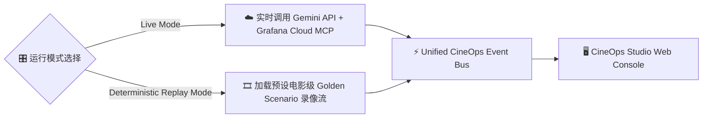

# 📡 CineOps Multi-Agent 通信协议与事件流规范
### *Agent-to-Agent (A2A) Protocol, Storyboard Events & MCP Integration Spec*

---

## 一、协议设计哲学 (Design Philosophy)

1. **结构化事件驱动 (Structured & Event-Driven)**：所有 Agent 的思考、任务分发、工具调用与结果反馈，均作为强类型的**制片事件 (Production Event)** 在事件总线上广播，支持前端 SSE 实时渲染与持久化归档。
2. **分镜式状态机 (Storyboard State Machine)**：任务生命周期严格按照电影制片流程推进（`SCENE_PLANNED` $\to$ `CAMERA_ACTION` $\to$ `TOOL_EXECUTED` $\to$ `SCENE_COMPLETED` $\to$ `PRODUCTION_WRAPPED`）。
3. **不可变与可确定性回放 (Immutable & Deterministic Replay)**：每一场排障或观测制片均生成唯一的 `production_id`，所有事件流具备时间戳与序号，支持离线 100% 确定性回放（用于比赛演示与灾后审计）。

---

## 二、事件流数据结构定义 (Event Stream JSON Schema)

每个在 CineOps Event Bus 上广播的事件，必须符合以下统一 Schema：

```json
{
  "$schema": "http://json-schema.org/draft-07/schema#",
  "title": "CineOpsProductionEvent",
  "type": "object",
  "properties": {
    "event_id": { "type": "string", "description": "UUID of the event" },
    "production_id": { "type": "string", "description": "Unique ID of the film production session" },
    "timestamp": { "type": "string", "format": "date-time" },
    "scene_number": { "type": "integer", "description": "Current Scene/Act number (1-based)" },
    "scene_title": { "type": "string", "description": "Short title of the scene, e.g. 'Scene 1: Anomaly Detection'" },
    "sender": {
      "type": "string",
      "enum": ["Director", "ObservabilityProducer", "StudioHead", "System"]
    },
    "event_type": {
      "type": "string",
      "enum": [
        "STORYBOARD_BREAKDOWN",   // Director 拆解分镜任务
        "AGENT_THOUGHT",          // Agent 内部思考 (Chain-of-Thought)
        "MCP_TOOL_CALL",          // 发起 MCP 工具调用
        "MCP_TOOL_RESULT",        // 接收 MCP 工具返回数据
        "SCENE_EVIDENCE",         // 专职 Agent 提交阶段取证结果
        "SAFETY_VERDICT",         // Studio Head 输出安全审计裁决
        "PRODUCTION_WRAP"         // 制片完成，输出总复盘报告
      ]
    },
    "payload": {
      "type": "object",
      "description": "Dynamic payload tailored to event_type"
    }
  },
  "required": ["event_id", "production_id", "timestamp", "scene_number", "sender", "event_type", "payload"]
}
```

---

## 三、各事件类型 Payload 规范 (Payload Specifications)

### 1. `STORYBOARD_BREAKDOWN` (导演分镜拆解)
当 Director Agent 接收到任务时，首先生成整个制片计划：
```json
{
  "event_type": "STORYBOARD_BREAKDOWN",
  "payload": {
    "mission": "Payment Gateway P0 Outage Investigation & Self-Healing",
    "total_scenes": 3,
    "scenes": [
      {
        "scene_number": 1,
        "title": "Anomaly Identification & Traffic Spike Analysis",
        "assigned_agent": "ObservabilityProducer",
        "objective": "Query Prometheus for 5xx error spike and latency degradation."
      },
      {
        "scene_number": 2,
        "title": "Root Cause Hunting via Loki Stacktraces",
        "assigned_agent": "ObservabilityProducer",
        "objective": "Scan error logs in Loki to locate precise traceback and failure reason."
      },
      {
        "scene_number": 3,
        "title": "Remediation Safety Audit & Execution",
        "assigned_agent": "StudioHead",
        "objective": "Validate pool expansion blast radius and approve auto-recovery."
      }
    ]
  }
}
```

### 2. `MCP_TOOL_CALL` (MCP 工具调用请求)
Observability Producer 向 Grafana MCP 发起查询：
```json
{
  "event_type": "MCP_TOOL_CALL",
  "payload": {
    "mcp_server": "grafana-mcp",
    "tool_name": "grafana_query_loki",
    "arguments": {
      "query": "{service='payment-api', env='prod'} |= 'ERROR' | json",
      "limit": 20,
      "start": "now-15m"
    },
    "call_id": "call_loki_982341"
  }
}
```

### 3. `MCP_TOOL_RESULT` (MCP 工具返回)
```json
{
  "event_type": "MCP_TOOL_RESULT",
  "payload": {
    "call_id": "call_loki_982341",
    "status": "success",
    "execution_time_ms": 142,
    "data_summary": "Found 18 error entries with DBConnectionPoolTimeout",
    "raw_data": [
      { "timestamp": "2026-09-02T21:40:12Z", "line": "ERROR [payment.db] DBConnectionPoolTimeout: connection pool exhausted (size=20, active=20, waiters=142)" }
    ]
  }
}
```

### 4. `SAFETY_VERDICT` (安全主管审查裁决)
```json
{
  "event_type": "SAFETY_VERDICT",
  "payload": {
    "action_proposed": "Dynamic DB Connection Pool Scale Up (20 -> 100) & Graceful Worker Reload",
    "decision": "APPROVED",
    "blast_radius": "LOW",
    "justification": "Target microservice is stateless. Scaling pool requires zero downtime and will immediately alleviate DB waiter queues.",
    "audit_hash": "sha256:7f83b16521..."
  }
}
```

---

## 四、确定性回放机制 (Deterministic Replay Engine)

为了保障 Hackathon 评委在任何网络环境下均能秒级体验完整的电影级排障效果，系统设计了**双模运行机制 (Dual-Mode Execution)**：



- **Live Mode**：连接真实 Gemini 2.5 API 与 Grafana Cloud 实例，执行实时的 LLM 推理与 MCP 远程请求。
- **Replay Mode**：内置 `scenarios/microservice_rescue.json` 与 `scenarios/agent_observability.json` 黄金事件流，以可控的时间间隔（可调节倍速：1x, 2x, 5x）向前端逐帧播放，确保录屏与 Demo 零失误。
