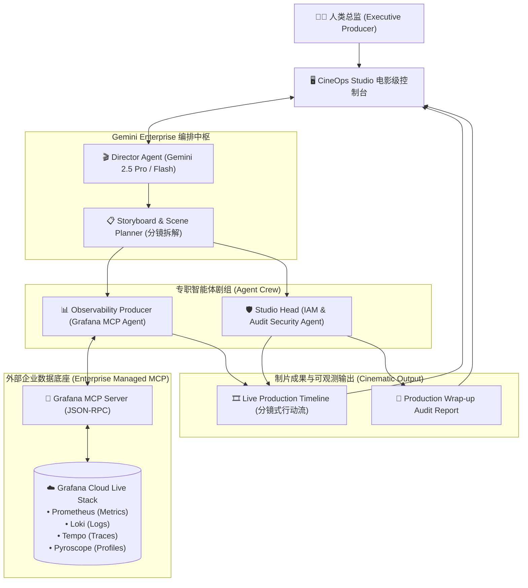

# 🎬 CineOps Studio: The Agentic Cinema Platform
### *Where Enterprise Observability Meets Hollywood-Grade Multi-Agent Orchestration*

[](https://cloud.google.com/vertex-ai)
[](https://grafana.com)
[](https://modelcontextprotocol.io/)
[](https://agentic-cinema.devpost.com)

> 🏆 **Google Cloud Agentic Cinema: The Blockbuster Hackathon 参赛作品**  
> 🎯 **主攻赛道**：**Grafana Labs Track ($25,000)**  
> ⏱️ **提交截止**：**2026年9月10日 05:00 (GMT+8)**

---

## 🌟 项目愿景与核心隐喻 (Concept & Vision)

> **“在智能体时代，单行代码只是背景音，真正的魔法在于系统级的 Multi-Agent 协同与企业级数据流水线编排。”**

**CineOps Studio** 以“好莱坞大片制片厂（Cinema Studio）”为隐喻，将企业级复杂的分布式系统运维与可观测性排障，抽象为一场**全自主的电影联合制片流水线**：

- 🎬 **Director (总导演 Agent - 编排中枢)**：基于 **Gemini Enterprise Agent Platform**，统筹全局战局、拆解分镜任务（Storyboard Breakdown）、调度专职智能体。
- 📊 **Observability Producer (技术观测制片 Agent - Grafana MCP)**：通过 **托管 MCP (Model Context Protocol)** 桥接 **Grafana Cloud**，实时调取 Prometheus 指标、Loki 错误日志与 Tempo 调用链。
- 🛡️ **Studio Head (制片厂安全主管 Agent - IAM 与审计)**：负责高危自愈操作的安全合规审批、变更审计，并输出电影级制片复盘报告（Production Wrap-up Report）。

---

## 🏛️ 系统核心架构 (System Architecture)



---

## 🎭 核心演示场景 (Dual-Scenario Showcase)

本项目内置**双场景电影级演示剧本**，覆盖企业外部服务故障排障与 AI 智能体集群内部可观测性：

- **🎬 Scene 1: 微服务雪崩实时排障与自愈 (Microservice Rescue)**
  - **剧情背景**：支付结算网关突发 500 错误风暴，系统吞吐暴跌。
  - **Director**：捕获告警，将其分解为 3 幕侦测镜头（Scene Breakdown）。
  - **Observability Producer**：通过 Grafana MCP 并行查询 Prometheus 错误率与 Loki 异常堆栈，精确定位到“数据库连接池泄漏”。
  - **Studio Head**：评估自愈动作风险，核准连接池动态扩容与热重载。
  - **产出**：系统 30 秒内自愈恢复，生成带 Grafana 证据链的制片审计报告。

- **🎬 Scene 2: AI Agent 自身性能与成本可观测性 (Agent Meta-Observability)**
  - **剧情背景**：AI 智能体集群高并发运转，需要精细化监控模型性能与推理开销。
  - **Director**：发起智能体全链路自检任务。
  - **Observability Producer**：调取 Grafana Cloud Pyroscope 算力火焰图、Gemini API Token 消耗曲线与 MCP 工具链延迟指标。
  - **Studio Head**：标记高耗时 Tool Call 瓶颈，自动提出 Prompt 压缩与工具缓存策略。
  - **产出**：Agent 集群健康雷达图与 Token 成本优化建议。

---

## 📚 详细设计文档索引 (Design Documentation)

本项目已建立完整的设计总纲体系，各专题纲领文档如下：

| 文档名称 | 内容定位 | 核心价值 |
| :--- | :--- | :--- |
| 📖 [**COMPETITION_GUIDE.md**](./COMPETITION_GUIDE.md) | **比赛全景与评分通关指南** | 官方规则、Grafana 赛道评审偏好、提交清单与评分拆解。 |
| 📐 [**TECH_BACKGROUND_AND_PROPOSAL.md**](./TECH_BACKGROUND_AND_PROPOSAL.md) | **系统架构设计与项目提案总纲** | 整体架构方案、技术选型、双场景剧本、7天敏捷冲刺排期。 |
| 📡 [**DESIGN_AGENT_COMMUNICATION_SPEC.md**](./DESIGN_AGENT_COMMUNICATION_SPEC.md) | **Agent 间通讯与分镜协议规范** | Multi-Agent 消息协议、MCP Tool Schema、状态流转与 Replay 机制。 |
| 🎨 [**DESIGN_CINEMATIC_UI_SPEC.md**](./DESIGN_CINEMATIC_UI_SPEC.md) | **电影级 Web 控制台 UI/UX 规范** | 场记板设计、分镜时间线交互、深色电影调色盘与组件规范。 |

---

## 🛠️ 快速启动与环境验证 (Pre-flight Verification)

在正式运行与演示前，可通过内置的验证探针检查依赖与凭证健康度：

```bash
# 1. 克隆并进入目录
git clone https://github.com/<your-org>/agentic-cinema.git
cd agentic-cinema

# 2. 配置环境变量
cp .env.example .env
# 编辑 .env，填入 GEMINI_API_KEY 与 GRAFANA_SERVICE_ACCOUNT_TOKEN

# 3. 运行前置环境与凭证检查探针
python3 scripts/verify_credentials.py
```

---

## 👥 团队与致谢 (Credits)

- **主办方**：Google Cloud
- **联合生态伙伴**：Grafana Labs, ClickHouse, Parallel, IBM, Replit
- **项目作者**：CineOps Studio Team
