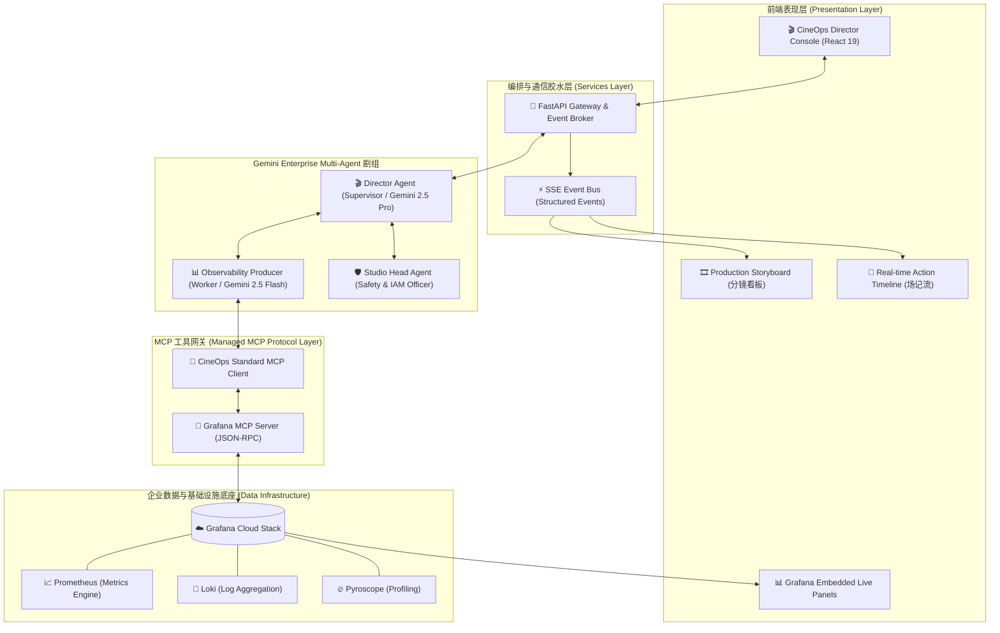
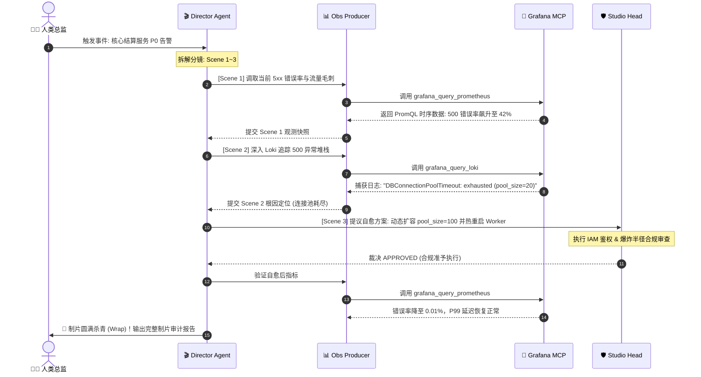
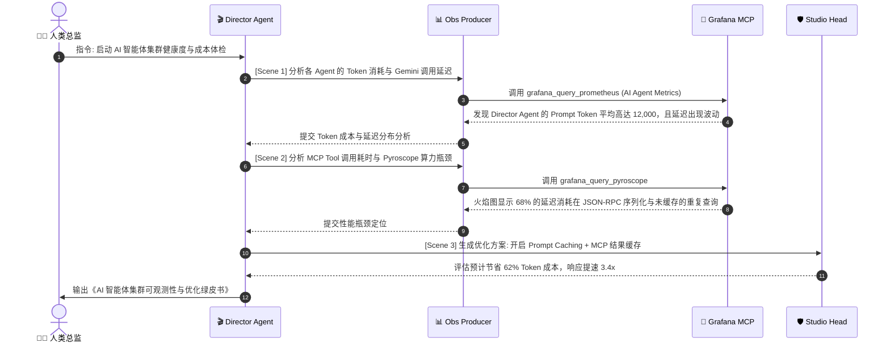

# 🎬 CineOps Studio: 系统架构设计与项目提案总纲
### *Enterprise Multi-Agent Observability Platform with Hollywood-Grade Orchestration*

---

## 一、方案设计总览 (Executive Summary)

### 1. 项目定位与核心命题
现代分布式微服务和 AI 智能体集群在面对高并发、突发流量倾泻或异常雪崩时，传统的 SRE 监控看板往往充斥着海量噪音，人工排查耗时耗力。**CineOps Studio** 将企业级运维与全链路可观测性抽象为一场**多智能体联合制片（Agentic Cinema）**。通过将 Gemini Enterprise 强大的推理编排能力与 Grafana Cloud 的全栈遥测数据通过标准 MCP (Model Context Protocol) 无缝连接，构建出一个全自主、高可解释性、可审计自愈的现代化智能运维控制台。

### 2. 核心技术栈选型
- **LLM 编排中枢**：Google Gemini Enterprise / Gemini 2.5 Pro & Flash（负责意图识别、分镜规划与推理总结）；
- **工具连接协议**：标准 Model Context Protocol (MCP) Client/Server 架构；
- **可观测性底座**：Grafana Cloud (Prometheus 指标, Loki 日志, Pyroscope 火焰图, Tempo 追踪)；
- **前端交互界面**：React 19 + Tailwind CSS + Lucide Icons（好莱坞深色电影制片风控制台）；
- **服务胶水层**：FastAPI / Python 3.11 异步框架 + SSE (Server-Sent Events) 实时事件总线。

---

## 二、系统全景架构设计 (Architecture Blueprint)



---

## 三、三大智能体角色规范 (Agent Personas & Contracts)

### 1. 🎬 Director Agent (总导演 - 编排中枢)
- **模型**：`gemini-2.5-pro` (需要极强的结构化逻辑拆解能力)
- **职责**：
  - 接收人类总监指令或系统告警事件；
  - 将宏观排障任务拆解为标准电影分镜头剧本（**Storyboard Breakdown**，由 3~5 个 Scene 组成）；
  - 动态调度下属 Agent，并在每幕完成后进行推理汇总与阶段复盘；
  - 决定排障是否收工（Wrap Production）。

### 2. 📊 Observability Producer (技术观测制片 - Grafana 专家)
- **模型**：`gemini-2.5-flash` (兼顾高并发、低延迟与精准 Tool Calling)
- **职责**：
  - 承接 Director 下达的具体分镜头数据调查指令；
  - 通过 MCP Client 调用 Grafana 工具，执行 PromQL 与 LogQL 检索；
  - 解析指标毛刺、提取异常日志堆栈中的报错关键行与时间窗口；
  - 向 Director 输出结构化的《现场观测取证报告》（Telemetry Evidence）。

### 3. 🛡️ Studio Head (制片厂安全总监 - 鉴权与审计)
- **模型**：`gemini-2.5-flash` / `gemini-2.5-pro`
- **职责**：
  - 对自愈策略（如限流、重启容器、连接池热扩容）进行 IAM 权限审查与破坏性影响评估（Blast Radius Analysis）；
  - 给出 **APPROVED** / **BLOCKED** 安全裁决；
  - 在最终幕生成具备企业级合规价值的《电影级制片复盘审计报告》（Production Wrap-up Report）。

---

## 四、Grafana MCP Server 接口工具定义 (Tool Definitions)

Grafana MCP Server 作为标准不可变黑盒工具适配器，向 Observability Agent 暴露以下 4 个核心 MCP Tools：

```json
[
  {
    "name": "grafana_query_prometheus",
    "description": "Execute a PromQL query against Grafana Cloud Prometheus to fetch system/service metrics.",
    "parameters": {
      "type": "object",
      "properties": {
        "query": { "type": "string", "description": "Valid PromQL expression, e.g., sum(rate(http_requests_total{status=~'5..'}[5m]))" },
        "start": { "type": "string", "description": "Start timestamp in ISO or relative format (e.g. now-15m)" },
        "end": { "type": "string", "description": "End timestamp in ISO or relative format (e.g. now)" }
      },
      "required": ["query"]
    }
  },
  {
    "name": "grafana_query_loki",
    "description": "Execute a LogQL query against Grafana Cloud Loki to fetch error logs, tracebacks, and warning entries.",
    "parameters": {
      "type": "object",
      "properties": {
        "query": { "type": "string", "description": "Valid LogQL query, e.g., {service='payment-api'} |= 'ERROR' | json" },
        "limit": { "type": "integer", "description": "Max log lines to return (default: 50)" },
        "start": { "type": "string", "description": "Start timestamp" }
      },
      "required": ["query"]
    }
  },
  {
    "name": "grafana_query_pyroscope",
    "description": "Fetch CPU/Memory profiling flamegraph analysis for AI inference services or microservices.",
    "parameters": {
      "type": "object",
      "properties": {
        "service_name": { "type": "string", "description": "Target service profile identifier" }
      },
      "required": ["service_name"]
    }
  },
  {
    "name": "grafana_get_active_alerts",
    "description": "Query currently firing alerting rules across all connected Grafana datasources.",
    "parameters": {
      "type": "object",
      "properties": {
        "state": { "type": "string", "enum": ["firing", "pending", "all"], "default": "firing" }
      }
    }
  }
]
```

---

## 五、双场景演示流水线详述 (Dual Storylines)

### 🎬 剧本 A：微服务雪崩排障与自愈 (Microservice Rescue)



---

### 🎬 剧本 B：AI Agent 集群自身的可观测性 (Agent Meta-Observability)



---

## 六、7 天极速敏捷冲刺排期 (Sprint Plan)

| 阶段 | 时间周期 | 交付目标 | 核心验证指标 |
| :--- | :--- | :--- | :--- |
| **Phase 1** | **Day 1 ~ Day 2**<br/>(9月3日 ~ 9月4日) | **胶水层与 MCP 核心打通**<br/>• 初始化 Python 项目结构<br/>• 封装 Gemini Enterprise API Client (带重试)<br/>• 实现 Grafana MCP Server 客户端 | 运行 CLI 能通过 MCP 成功执行真实 PromQL / LogQL 查询。 |
| **Phase 2** | **Day 3 ~ Day 4**<br/>(9月5日 ~ 9月6日) | **Multi-Agent 剧组与双场景状态机**<br/>• 实现 Director / ObsProducer / StudioHead 协同逻辑<br/>• 注入剧本 A & B 真实测试数据流与 Deterministic Replay | 命令行端到端完整跑通双场景 6 幕分镜全流程。 |
| **Phase 3** | **Day 5**<br/>(9月7日) | **CineOps 电影级深色控制台**<br/>• React 19 + Tailwind 前端开发<br/>• 实时分镜卡片、呼吸灯、Action Timeline 联调 | 前端可在浏览器流畅播放 Agent 思考与执行动画。 |
| **Phase 4** | **Day 6 ~ Day 7**<br/>(9月8日 ~ 9月9日) | **视频录制、部署与 Devpost 提交**<br/>• 录制 2.5 分钟高燃英文演示视频并加英文字幕<br/>• 部署 Demo 在线环境或提供一键 Docker/脚本<br/>• 提交 Devpost 并检查所有材料 | 9月10日 05:00 前全部 Checklist 验收打勾。 |
